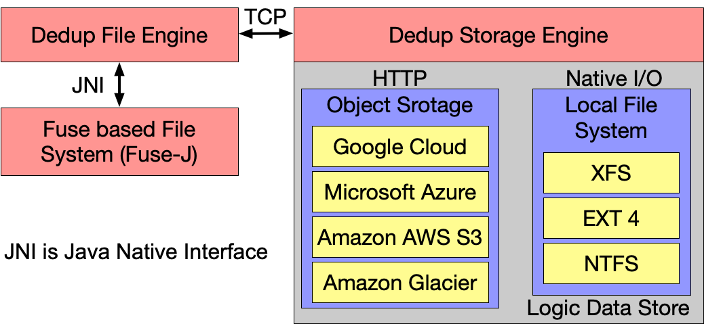
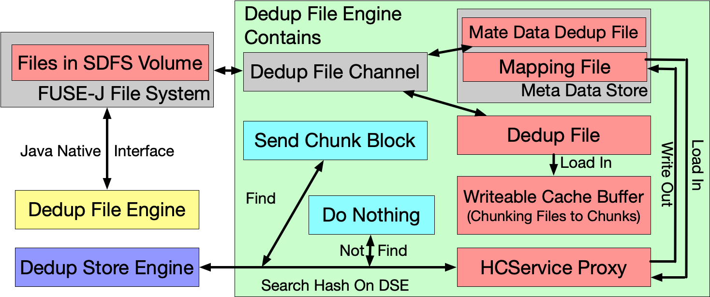
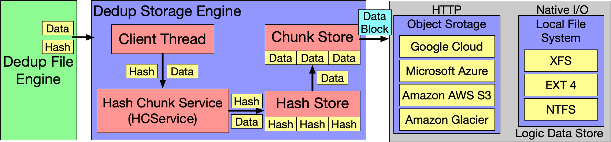

<!-- **Table of Contents**

[TOC] -->

## Introduction

[SDFS](https://github.com/opendedup/sdfs) is a distributed and expandable filesystem designed to provide inline deduplication and flexibility for applications. 

The system has two deployment methods : 

* Standalone Volumes

> This deployment method actually stores data in the local file system.

* Multi-Node Configuration

> The deployment method actually allows the user to store data at least one remote end.
 <!-- more -->
## System Architecture

> Key Words Table

| KeyWord in SDFS | Normal |
| --- | --- |
| MetaData Dedup File | File Metadata |
| Mapping File | File Recipe Index |  
|HCService Proxy| Dedup Core |
|Chunk Store | Container Maker|
|Hash Store | Fingerprint Index|

### Overall Structure of The System

The overall structure of the system is shown below:

The system mainly consists of the following four parts, where Dedup File Engine and Dedup Storage Engine are the main components of the SDFS system:

* **Fuse Based File System (Fuse-J)** [C implement, Open source file system]
* **Dedup File Engine** [Java implement, opendedup]
* **Dedup Storage Engine** [Java implement, opendedup]
* **Logic Data Store** [Provided by the operating system or cloud service provider]

### Dedup File Engine

The workflow of the Dedup File Engine is shown below : 

This section will explain how the Dedup File Engine works and related system implementations.

SDFS connects Dedup File Engine to the Volume of the actual file stored via FUSE-J by Java Native Interface(JNI). Then take a closer look at the specific content of each module in Dedup File Engine.

#### Fuse-J Java Native Interface

* File Statistics and Advanced file manipulation is done through getting and setting extended file attributes (getfattr setfattr).
* Each mounted volume uses it own Fuse-J interface and Dedup File Engine instance.

#### Dedup File Channel

This part is implemented at `/sdfs/src/org.opendedup/sdfs/io/DedupFileChannel.java`.

It's the interfaces between Fuse-J and DedupFile for I/O commands. It provides ways (like get file metadata/read or write file) to get the files that will be deduplicated. 

#### Meta Data Store

Each logical SDFS file is represented by two different actual pieces of metadata and held in two different files. This part is implemented at `/sdfs/src/org.opendedup/sdfs/io/MetaDataDedupFile.java`.

##### Meta Data Dedup File

This file is stored in a filesystem structure that directly mimics the filesystem namespace that is presented when the filesystem is mounted. As an example, each of these files is named the same as it appears when it is mounted and looks as if it's in the same directory structure under `/opt/sdfs/volumes/<volume-name>/files/`. This file contains all of the filesystem attributes associated with the file, including size, atime, ctime, acls, and link to the associated map file.

##### Mapping File

This file contains the list of records, corresponding to locations to where the blocks represent data in the file. Each record contains a hash entry, whether the data was a duplicate, and when the data is stored on remote nodes, what nodes that data can be found on.

This data is located in `/opt/sdfs/volumes/<volume-name>/ddb/`, each record has the following data structure.

| dup | hash |  reserved | hash location |
| --- | --- | --- | --- |
| 1 byte | hash algo length |  1 byte | 8 bytes | 

#### DedupFile

It contains a map of Hashes to File Locations for deduplicating data. Persisted using Customer Persistent HashTable. This part is implemented at `/sdfs/src/org.opendedup/sdfs/io/DedupFile.java`.

#### WritableCacheBuffer

It contains a chunk of data that is being read or written to inline. DedupFile(s) cache many of these during I/O activity. This part is implemented at `/sdfs/src/org.opendedup/sdfs/io/WritableCacheBuffer.java`. 

In this part, SDFS using SparseDedupFile class (implemented at `/sdfs/src/org.opendedup/sdfs/io/SparseDedupFile.java`) to deal with the data in writableCacheBuffer (get Chunks).

SDFS supports **two chunking methods**: Fixed Size Chunking and Rabin Variable Size Chunking.

The system claims to implement a number of hashing methods, but the actual situation is as follows (all the hash functions are implemented in `sdfs/src/org.opendedup/hashing/`):

| Hashing Method | Implement |
| --- | --- |
|`VariableHashEngine` |Done|
|`Tiger16HashEngine` |Not Done|
|`VariableSha256HashEngine`| Done |
|`Murmur3HashEngine` |Not Done|
|`VariableHaighwayHashEngine`| Done |
|`SipHashEngine`| Done |
|`VariableMD5HashEngine`| Not Done|
|`AbstractHashEngine` | Done |

#### HCService Proxy (HC == HashChunk)

This part is implemented at `/sdfs/src/org.opendedup/sdfs/servers/HCServiceProxy.java`.

HCServiceProxy looks up a route, to the appropriate deduplicate storage engine, for the hashed chunk (WritableCacheBuffer) based on the 1st byte of the hash (If multiple DSE is set up).

Based on route HCServiceProxy queries the appropriate `dedup storage engine` to see if the hash is already persisted.
 
If the hash is persisted then no other action is performed. If not the hash is sent to the `dedup storage engine` either compressed or not based on configuration settings.

### Dedup Storage Engine

The Dedup Storage Engine (DSE) stores, retrieves and removes all deduped chunks. The deduplication storage engine could run as part of an SDFS Volume (Standalone model). Chunks of data are stored on disk, or at a cloud provider, and indexed for retrieval with a custom written hash table. The DSE database is stored in `/opt/sdfs/volumes/<volume-name>/chunkstore/hdb-<unique id>/`.

This part is implemented at `/sdfs/src/org.opendedup/sdfs/servers/`, `/sdfs/src/org.opendedup/sdfs/filestore/` and `/sdfs/src/org.opendedup/sdfs/io/BlockDev.java`.

The workflow of `Dedup Storage Engine` is shown below : 

1. ClientThread receives a `WRITE_HASH_CMD` or a `WRITE_COMPRESSED_CMD` and reads the hash and data.
2. ClientThread passes the hash to the HashChunkService.
3. HashChunkService passes hash and data to the appropriate HashStore.
4. HashStore stores the hash and sends the data to the assigned ChunkStore (as a map to logic data store).
5. ChunkStore stores data (as a data block to logic data store).

**Only One type of ChunkStore can be used per Dedup Storage Engine Instance**

Dedup Storage Engine is made of 2 basic components : 

* HashStore

> The hash store contains a list of all hashes and where the data represented by that hash is located. 

* ChunkStore
    * Local Chunk Store: 
        * File Chunk Store – Saves all data in one large file
        * File Based Chunk Store - Saves all chunks as individual files
    * Remote Chunk Store:
        *  Amazon S3 
        *  Microsoft Azure
        *  Google Cloud

> ChunkStore is responsible for storing and retrieving the data associated with a specific hash.

    
#### Data Blocks

Unique data chunks are stored together in Archive Files by the Dedupe Storage Engine(DSE) either on disk or in the cloud. The Dedupe Storage Engine stores collections of data chunks, in sequence, within data blocks in the chunk store directory. New blocks are closed and are no longer writable when either their size is reached or the block times out waiting for new data. Writable blocks are stored in `chunkstore/chunks/outgoing/`.

The DSE creates new blocks as data is unique data is written into the DSE. Each new block is designated by a unique long integer. When unique data is written in, the DSE either compresses/encrypts the chunk and then writes the chunk into a new block in sequence. It then stores a reference to the unique chunk hash and the block’s unique id. The block, itself keeps track of where unique chunks are located in a map file associated with each chunk. As blocks reach their size limit or timeout they are then closed for writing and then either uploaded to the cloud and cached locally or moved to a permanent location on disk `/chunkstore/chunks/[1st three numbers of unique id]/`. The map file and the blocks are stored together.

## Working Example

### Store struct 

After mounting the SDFS file system via `mount -t sdfs pool0 /media/pool0`, SDFS will generate the following folders in `/opt/sdfs/volumes/pool0` directory(only in standalone model, the `chunkstore/` and `keys/`folder will appear here): 

#### ChunkStore/ folder: 

This folder contains ChunkStore & HashStore in DSE part (defined in `DSEconfigWriter.java` line 115 to line 118). 

`ChunkStore/chunks` will store all unique chunk's logic data (folders sort by the first 3 number of chunk hash)

`ChunkStore/hdb-xxxx` will store HashStore's DB. This DB stores all unique chunk's index & path to find that chunk.

#### files/ folder: 

This folder contains all the files‘ symbol link (soft link). (The file has ever written into the mounted volume.)

#### ddb/ folder: 

This folder contains the HashMap for every single file in the client side (see: metadata file: mapping). This kind of files will end up with `.map` (save the data struct of HashMap & all data in it).
   

#### keys/ folder

This folder is the other one which should show up in  DSE server side (but for the standalone model it will store with the client side files). This `volume.keystore` will store the associated maps of chunk blocks.

### Deduplication workflow in a standalone mode

#### Step 1 : Dedup in Single File

After the SDFS retrieves the file from the mounted volume, it chunks the file and send chunks (class: finger) to the `sparseDedupFile` function, and completes the deduplicate in the file through HashMap. And write the HashMap to the `ddb/` folder. (The chunk logic order and chunk order obtained by traversing the HashMap is irrelevant)

#### Step 2: Dedup Between Fils

SDFS searches the file that completed the inside file deduplication and reads the corresponding mapping file (in `/ddb/`). Check whether the chunk has been stored by DSE through HCServiceProxy. After completing the deduplicate between files, update the mapping file in client side (mark the status and location of the chunks).