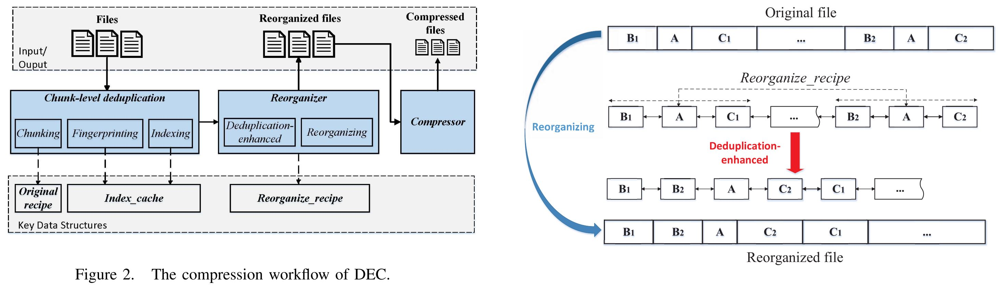
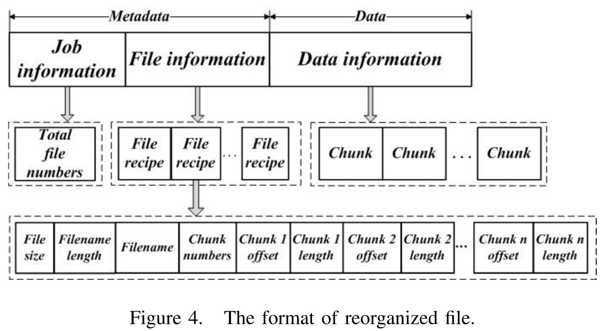

## Reference

> Han Z, Xia W, Hu Y, et al. [DEC: An Efficient Deduplication-Enhanced Compression Approach](https://cswxia.github.io/DEC-ICPADS'16.pdf). In Proc. of ICPADS, 2016.

## What

Design and implement DEC, which combines deduplication and compression. It exploit data locality to compress similar chunks by clustering the data chunks which are adjacent to the same duplicate chunks.

 <!-- more -->

## Why

* Deduplication could only identify and remove same data chunks (files).
* Delta compression could remove redundancy between similar chunks, but need additional compute and memory resource.
* Current combine method (on top of deduplication):
    * SIDC: P. Shilane, M. Huang, G. Wallace, and W. Hsu, **WANoptimized replication of backup datasets using streaminformed delta compression**, ACM Transactions on Storage (TOS), vol. 8, no. 4, p. 13, 2012.
    * DARE: W. Xia, H. Jiang, D. Feng, and L. Tian, **Combining deduplication and delta compression to achieve low-overhead data reduction on backup datasets**, in Proc. IEEE DCC, 2014.
    * Ddelta: W. Xia, H. Jiang, D. Feng, L. Tian, M. Fu, and Y. Zhou, **Ddelta: A deduplication-inspired fast delta compression approach**, Performance Evaluation, vol. 79, pp. 258–272, 2014.
* **DARE** checks the similarity of duplicate chunks neighbors through chunk locality to improve compression efficiency.
* Previous combination method can only be performed in a small window size.

## How

Cluster data around the same duplicate chunks to solve the problem of local restriction on traditional compression window, which can not eliminate the redundancy across different windows.

* Put the neighbors of the same chunk together. 
* Check all possible similar chunks which are scattered throughout the file in a single compression window.

## Some Details

* DEC system structure

* Use Asymmetric Extreme chunking (new fast & efficient CDC approach, Y. Zhang, H. Jiang, D. Feng, W. Xia, M. Fu, F. Huang, and Y. Zhou, **AE: An asymmetric extremum content defined chunking algorithm for fast and bandwidth-efficient data deduplication**, in Proc. IEEE INFOCOM, 2015.) instead of traditional Rabin-based chunking.
* Using a in memory hash table as `chunk index`, while use `original recipe` to record file structure.
* Generate reorganize file for compression window.

## Summary

### Strength

* Theoretical analysis of the cost of each part in system.
* Simple but very effective idea, which makes use of the locality of the chunks and achieve better results than DARE.
* Complete experiments, experimental comparison of each modules' algorithm selection.

### Weekness

* This solution can only be used for the current input data stream, and cannot do deduplication and compression with existing data (Limited effect on long / large data writes).
* For large files, there is a problem that the memory overhead is too large or cannot be used (only the maximum 3GB file was tested in the experiment).