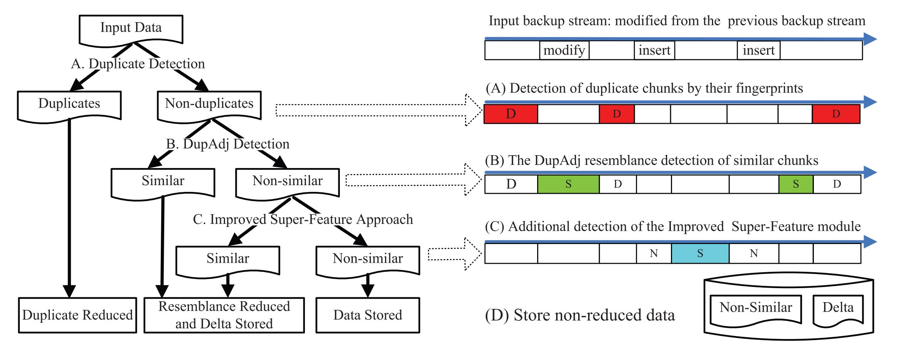
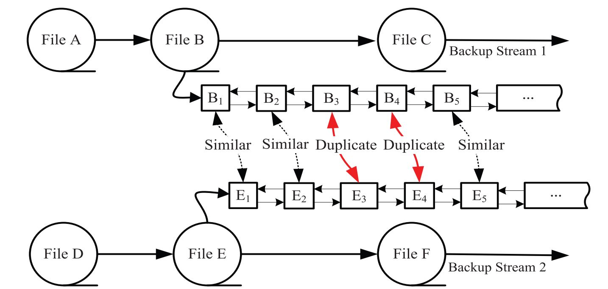

## Reference

> W. Xia, H. Jiang, D. Feng, and L. Tian, [Combining deduplication and delta compression to achieve low-overhead data reduction on backup datasets](https://cswxia.github.io/pub/dcc-wen-delta-2014.pdf), In Proc. of IEEE DCC, 2014.

## What

Propose **DARE**, a deduplication aware similarity detection and elimination scheme for compressing backup data.
<!-- more -->

## Why

* Deduplication could only identify and remove same content (including chunk/file level).
* Delta compression could remove redundancy between similar content.

## How

For an incoming backup stream:

1. **Deduplication**: Variable size chunking, and keep unique chunks' sequential in container (keep locality).
2. **Similarity Check**:  
    * `Duplicate-Adjacency based Resemblance Detection`: Select similar chunks based on chunk locality in a small range (based on logic chunk order list)
    * `Super-Feature based method`: Find more similar chunks in each file.
3. **Delta Compression**: Use LRU and locality-preserved cache to prefetch base chunks in the form of locality-preserved containers.
4. **Storage Management**: File recipe will record the file mapping information for all duplicate chunks, resembling chunks and non-similar chunks.

## Some Details

* Duplicate-Adjacency based resemblance detection method.

* The expected value of similarity detection can be expressed as a function of the number of features per superfeature and the number of super-features (N=feature number; M=super feature number;):

$$
\int_{0}^{1} x(1-(1-x^N)^M)\, dx = \sum\limits^M_{i=1}C^i_M (-1)^{i+1} \frac{1}{N \times i+2}
$$

* **The fewer features each superfeature contains, the stronger the similarity detection capability**
* Two features per super-feature hits the “sweet spot” of similarity detection in deduplication systems in terms of cost effectiveness.

## Summary

### Strength

* Theoretical and practical analysis of the difference in the effectiveness of feature / super feature number on similarity check.
* Comprehensive experiments for different similarity detect configure.

### Weekness

* The performance of DARE is highly dependent on high-throughput io devices such as ssd, but even though, the performance is still significantly lower than the io device performance, which indicates that there is a large computational overhead.
* The cost of super feature calculation is analyzed in detail, but the cost of `Duplicate-Adjacency` is not analyzed separately, which cannot indicate whether the trade-off between the storage space savings of about 6% and the performance degradation is reasonable.
* The experimental comparison was only carried out in the centralized scheme designed by this paper. There is no comparative description of the two schemes in related work.
