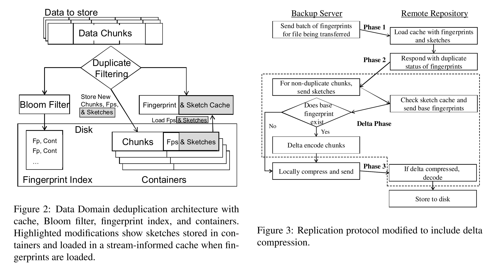
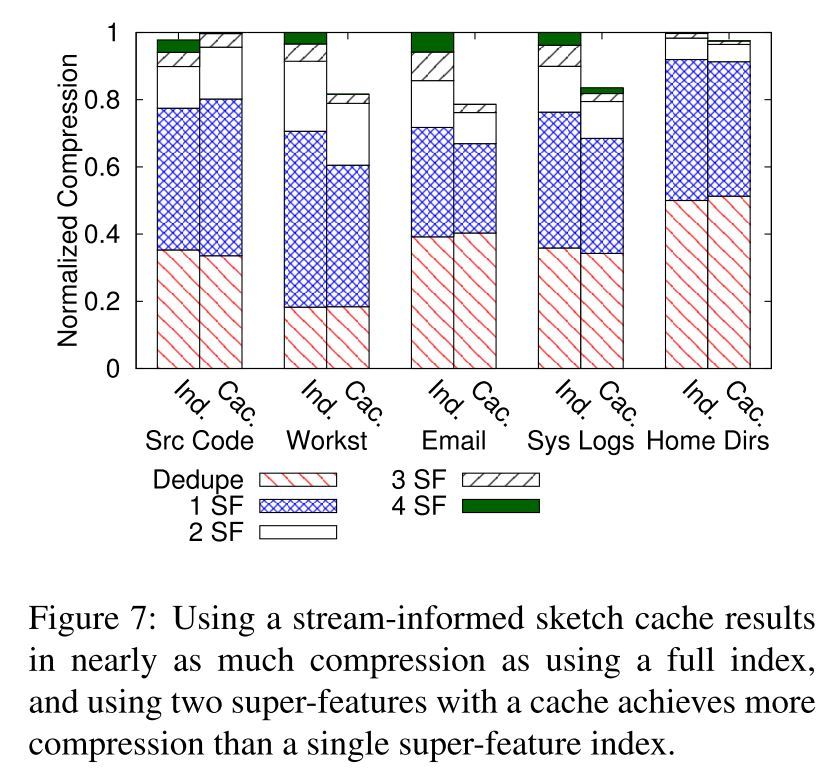

## Reference

> P. Shilane, M. Huang, G. Wallace, and W. Hsu, [WAN-optimized replication of backup datasets using streaminformed delta compression](https://static.usenix.org/event/fast/tech/slides/Shilane.pdf), ACM Transactions on Storage (TOS), vol. 8, no. 4, p. 13, 2012.

## What

Present a new method for replicate data via WAN which could eliminates duplicates and compresses similar data with delta compression (Avaliable in Dell EMC Data Domain System).
<!-- more -->

## Why

* WAN bandwidth has not increased with data growth rates.
* Shipping tapes is a common backup method but has the disadvantages of being cumbersome, open to security breaches, and difficult to verify success.
* **The main problem**: How to achieve the highest possible compression during WAN replication?

## How

* Trade off between three index method:
    * **Full Sketch Index**: Best similarity detect if sketch with all chunks, highly cost even sketch with super features.
    * **Partial Sketch Index**: Sketch index for a shorter region of data with FIFO/LRU cache, but not suitable for  backup workload (most backup are cross weeks).
    * **Stream-Informed Sketch Cache**: Similarity detection has the same stream properties as deduplication, loading a previous stream fingerprint index and sketch into cache.
* Deduplication use a fingerprint & sketch cache at first and use bloom filter second.
* Backup server only transfer unique chunks and delta compressed information to remote repository.(fingerprints & sketchs are send as metadata for client-side deduplication and compression).

## Some Details

* System workflow

* Impact of the number of super features:

## Summary

### Strength

* Complete experiments, especially on three kind of index sketch compare and different level of delta compression.
* Real-world availability and small modify to origin DDFS.
* Explore and analyze the similar chunks have locality as well as duplicate chunks. 

### Weakness

* The paper also mentioned the impact of the coexistence of different backup streams, but it has not been resolved.