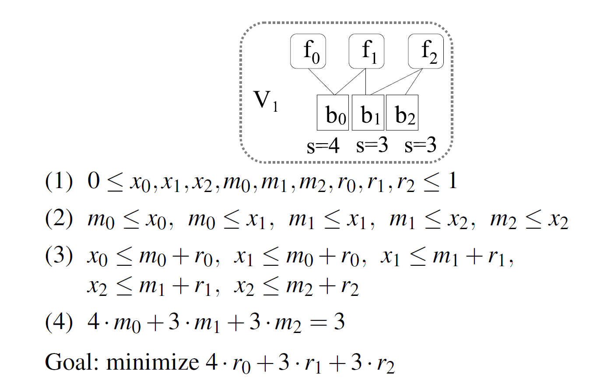

## Reference

> Nachman Aviv, Yadgar Gala, Sheinvald Sarai. [GoSeed: Generating an Optimal Seeding Plan for Deduplicated Storage](https://www.usenix.org/system/files/fast20-nachman.pdf). In Proc. of USENIX FAST, 2020.

## What

Introduce GoSeed which is a formulation of seeding as an integer linear programming (ILP) problem, and three acceleration methods for applying it to realsized storage volumes.

* **Data migration**: transfer files and their blocks between volumes.
* **Seeding**: data migration with empty destination.

<!-- more -->

## Why

* Deduplication save storage space while create data-sharing dependenices, which complicate storage management task.
* File remap cause replication (some block will be used by different files in different volumes).
* Current solution use greedy algotithm, but the efficiency of the migration plans is not systematically compared (No theoretical studies). 
* Integer Linear Programming (ILP) solvers are efficient with 100K variables, but deduplication system always contains ~10TB/~billion variables.

## How

### The seeding problem model (ILP)

* Migrate M% physical occupancy to an empty destination.
* Files are kept/remapped; Chunks are kept/moved/replicated
* Chunks are moved/replicated with their files.
* **Target:** *minimize chunk replication*.

### Optimizations

* Solver timeout: stop solver when hit time limits, and get the current best solution. **Inability to measure the gap with the optimal solution**.
* Fingerprint sampling: sample the subset of all fingerprints (sample degree $k$ means sample $\frac{1}{2^k}$ of all fingerprints). **Information lost**.
* Cantainer based aggregation: treat each container as a chunk. **If container including one chunk which belones to different files, may cause the container to be marked as replicate**.

## Some Details

* Current works on data migration:
    * Rangoil [Nagesh & kathpal, Systor'13]:
    * SGreedy [Harnik, FAST'19]

## Summary

### Strength

* Very interesting, simple and effective idea.
* Detailed analysis of possible optimization methods and their trade-offs, the experiment is very complete.
* Significant results compared to existing high-level works.

### Weekness

* Combining container-level and chunk-level plans may have better effect.