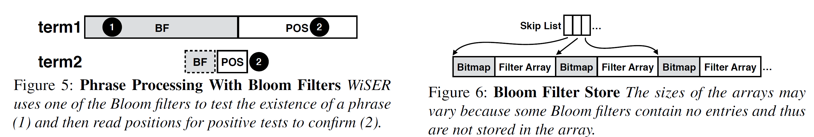

## Reference

> He Jun, Wu Kan, Kannan Sudarsun, Arpaci-Dusseau Andrea, Arpaci-Dusseau Remzi. [Read as Needed: Building WiSER, a Flash-Optimized Search Engine](https://www.usenix.org/system/files/fast20-he.pdf). In Proc. of USENIX FAST, 2020.

## What

Based on read as needed rather than cache to build a elasticsearch search engine WiSER which is optimized for small RAM with high throughput SSD.

<!-- more -->

## Why

* RAM is far more expensive than SSD, and only use RAM may waste the bandwidth (~100GB/s).
* The total capacity of RAM is much smaller than SSD on a single machine.

## How

### Main targets

* Reduce read amplification
* Hide I/O latency
* Use large request to improve device efficiency

### Four main techniques:

* Cross-stage data grouping
    * Stage method: include frequencies, positions, and offset terms in different files.
    * Cross-stage: integrate these terms into single file (most could be fit in 4KiB). It saves 3X I/O operations.
* Two-way cost-aware bloom filters
    * Plain bloom filters: not fit for phrase queries (increase I/O traffic)
    * Two-way: chooses the smaller filter for filtering, build two filters for word's before and after, if can't reduce I/O, don't use filters.
    * Use bitmap to reduce filters storage overhead.
* Adaptive perfetching: put the most commonly accessed data include metadata, skip list, document IDs, and term frequencies into a `prefetch zone` to help system prefetch content.
* Trade disk space for I/O: compress each document individually (basic elasticsearch compress many documents at same time) to avoid reading and decompressing unnecessary documents with small space overhead (LZ4. et. al. achieve better compression with larger input).

## Some Details

* Using Wikipedia and scientific papers from PubMed Central (PMC) for evaluation.
* Bloom filter and bitmap management:

## Summary

### Strength

* With the support of modern SSDs, it breaks through the traditional idea of improving performance through caching and specifies a new direction for performance optimization.

### Weakness

* Under the current development of persistent memory, is this solution have better cost performance than PM?