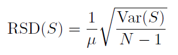

## Reference

> Cao Zhen, Kuenning Geoff, Zadok Erez. [Carver: Finding Important Parameters for Storage System Tuning](https://www.usenix.org/system/files/fast20-cao.pdf). In Proc. of USENIX FAST, 2020.

## What

Carver is a file system parameters selection and tunning method, which uses:
* Variance-based metric to quantify storage parameters' importance.
* Latin Hypercube Sampling to sample huge parameter spaces,
* Greedy but efficient parameter-selection algorithm to identify important parameters. 

<!-- more -->

## Why

* Storage system parameters' default setting are often no optimal, the best parameters can provide significant gains (performance, latency, space). 
* Storage system parameter space is huge (Ext4: 59 parameters with $10^{37}$ configs). 
* Parameters are not equally important.
* Tunning result is just for current hardware or workloads, which is not transferable.

## How

* Measure parameters importance:
    * Classification parameters.
    * Conditional parameter importance (CPI): ($P_2$ | $P_1$ = p), given $P_1$ fixed to p, find importance of $P_2$.
* Parameters sampling method: **Latin Hypercube Sampling**
    * One sample in each row and each column.
* Parameter selection:
    * Assume $X_i$ is the first important parameter, calculate CPI for any other $X_j$ with any value p to find the maximum CPI($X_j$|$X_i$), than find the second important parameter.(Find more important parameters through loop operations)
    * Stop loop if find enough parameters or variance within subsets of configurations (fixing values of selected parameters) falls below threshold.
    * **Will extended into multi-objective optimization**

## Some Details

*  Relative Standard Deviation (RSD) or Coefficient of Variation (COV) to define parameter stopping condition. 
* The RSD of a set S of configurations is defined as (N is the number of configurations and $\mu$ is the mean throughput of configurations within S):

## Summary

### Strength

* Introduce Latin Hypercube Sampling which significantly reducing the parameters that need to be analyzed.
* Reasonable function and threshold settings, so that only a small amount of data is needed to obtain near-optimal parameters.

### Weekness

* The parameter setting obtained by this method is still an near-optimal solution.
* This method is more like reducing the complexity of brute force calculations and forming a parameter importance experience without forming an axiomatic parameter setting scheme.