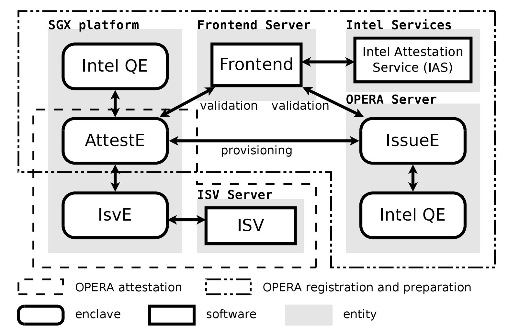
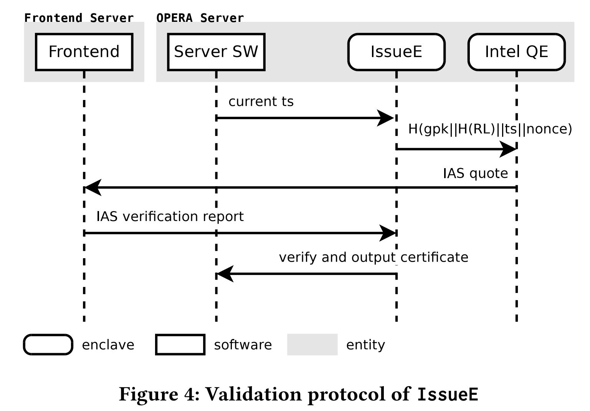
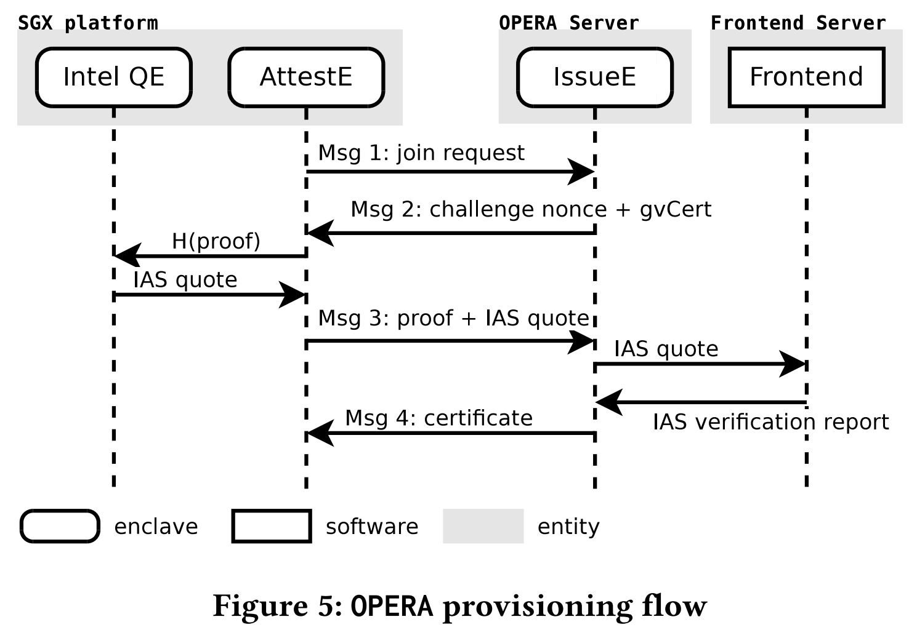
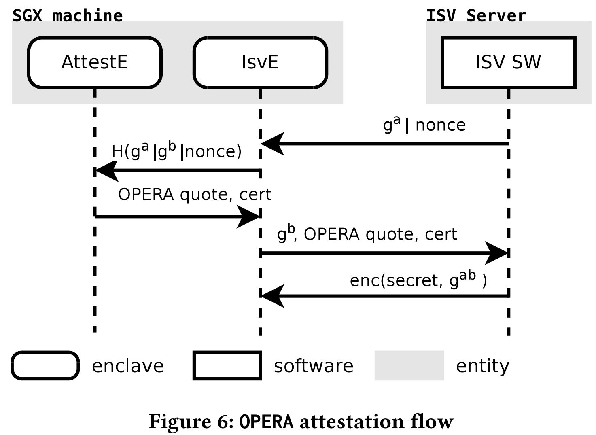
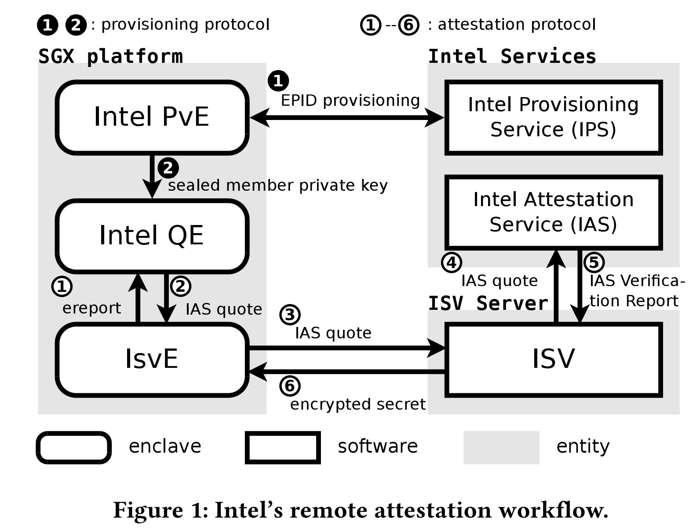
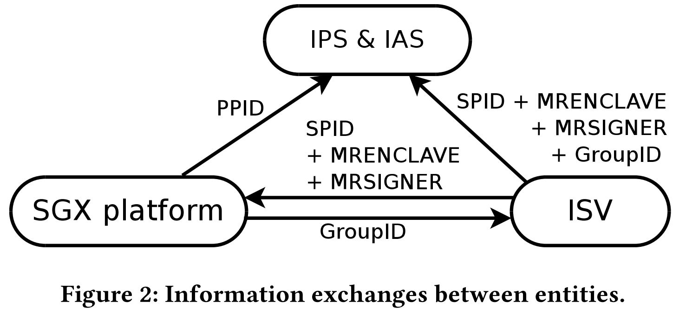

## Reference

> Guoxing  Chen, Yinqian  Zhang , Tenhwang  Lai. [OPERA: Open Remote Attestation for Intel's Secure Enclaves](https://dl.acm.org/doi/pdf/10.1145/3319535.3354220?download=true). In Proc. of ACM CCS, 2019.

## What

This paper presents OPERA, an Open Platform for Enclave Remote Attestation. OPERA is unchained from Intel attestation service, although it relies on Intel to establish a chain of trust whose anchor point is the secret rooted in SGX hardware.
<!-- more -->

## Why

* Every attestation request must go through Intel IAS to be validated (Intel’s quoting enclaves encrypt the quotes with Intel’s own public key and only Intel IAS is able to decrypt the quotes and verify the attestation).
* Information leakage when use IAS service (If intel service not safe):
    1. Which ISV is conducting attestation (through its service provider ID, or SPID) and the IP address (through the TLS connection with IAS)
    2. Which enclave is being attested (through MRENCLAVE)
    3. Who signed the enclave (through MRSIGNER), 
    4. The content ofthe 64B attested data (embedded in the quote).
* Intel-centric Internet-based single-point-of-verification model is insufficient to sustain the high volume of attestation requests (like block chain applications).
* The latency of quote verification is too long, which negatively impacts the performance of applications.
* Intel only support third-party attestation in big data center.

## How

* Overview:

* Compontents:
    * IssueE: At cloud SGX server. Responsible for generating an EPID group issuing key, which is used to issue member keys to AttestEs and to produce group verification certificates (gvCert).
    * AttestE: At SGX client which need attestation services. Communicates with IssueE to obtain unique EPID member private key, and do remote attestation to IssueE. Then the AttestE serves the local attestation requests from the ISV enclaves (called IsvEs) and produces quotes (called OPERA quotes) that are signed by its EPID private key.
* Steps:
    1. Registration: launches, validates, and registers an IssueE to OPERA.
    
    2. Preparation: launches an AttestE on one SGX platform, validates its authenticity, and provisions the EPID private key into the AttestE by running a provisioning protocol with an IssueE.
    
    3. Attestation: attests the authenticity of an IsvE (ISV enclave) that run on the same machine as the AttestE.
    
    * The validation of IssueE and AttestE needs to be run periodically to check the validity of the SGX platform using IAS and establish trustworthiness of these enclaves.
* Main Idea: **Hand over the original remote attestation to the local attestation enclave, only do remote attestation for the assists enclaves.**

## Some Details

* Intel remote attestation workflow and information transfer between entities:

## Summary

### Strength

* Without reducing (partially improving) the security, significantly reduce the latency of the enclave remote attestation, and improve the performance of the remote attestation.

### Weakness

* Fullly proof of security, but difficult to understand.