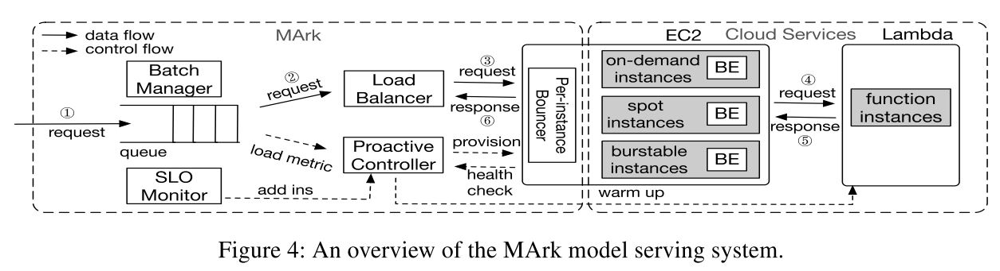

## Reference

> Chengliang Zhang, Minchen Yu, Wei Wang,  Feng Yan. [MArk: Exploiting Cloud Services for Cost-Effective, SLO-Aware Machine Learning Inference Serving](https://www.usenix.org/system/files/atc19-zhang-chengliang.pdf). In Proc. of USENIX ATC, 2019.

## What

This paper tackles the dual challenge of SLO compliance and cost-effectiveness with MArk (Model Ark), a general-purpose inference serving system built-in Amazon Web Services (AWS).

* [SLO](https://blog.csdn.net/eurus_5bb67476/article/details/77371654) compliance: A service-level objective (SLO) is a key element of a service-level agreement (SLA) between a service provider and a customer. SLOs are agreed upon as a means of measuring the performance of the Service Provider and are outlined as a way of avoiding disputes between the two parties based on a misunderstanding.

<!-- more -->

## Why

* Minimize the cost of cloud computing for machine learning while achieving the best performance.

## How

* MArk model:

* SLO requirements: 
    1. Response Time Threshold: A request is deemed fulfilled only if its response time is below RTmax.
    2. Service Level: The service is considered satisfactory only if at least SLmin percent of requests are fulfilled.
* Workload Prediction (estimate the maximum request rate shortly):
    * Vanilla version of long short-term memory ([LSTM](https://en.wikipedia.org/wiki/Long_short-term_memory)) network for multi-step workload prediction.
* Instance Provisioning and Batching:
    * **Adaptive batching** to fit all SLO requirements and through with batching must greater than no batching.
    * Online heuristic algorithm considers both long-term cost-effectiveness and the launch overhead.
    * Actively monitor request latency to avoid SLO violations (When SLO violations happen, scales the cluster).
* Get discount by use spot instances:
    * Spot instances will alert the user before the stop in 2 minutes, which may not enough for substitute instance to get ready.
    * Keep some spot instances as cold standbys.

## Some Details

* Three types of service: IaaS, CaaS, and FaaS
    * IaaS: Infrastructure as a Service, user deploy system and program to run.
    * CaaS: Container-as-a-Service, user encapsulate services and implementations in containers (e.g., Docker images), and run containers with specified resource configurations in the cloud.
    * FaaS: Function as a service (e.g., AWS Lambada, serverless compute), user build program according to service provider's model.
* Key findings in these services:
    * IaaS achieves the best cost and latency performance for ML model serving, and combining it with FaaS can potentially reduce overprovisioning while remaining scalable to spiky workloads.
    * Burstable instances are viable to cover transient ML serving demand. 
    * In on-demand CPU market, smaller instances have higher performance-cost ratio than the bigger ones, even though the latter provides shorter latency.
    * Only with appropriate batching can the use of GPU instances be justifiable to achieve lower cost and shorter latency than CPU instances.
* LSTM: 
    > GERS, F. A., SCHMIDHUBER, J., AND CUMMINS, F. Learning to forget: Continual prediction with LSTM. In the 9th International Conference on Artificial Neural Networks (1999).
* Adaptive batching:
    > CRANKSHAW, D., WANG, X., ZHOU, G., FRANKLIN, M. J., GONZALEZ, J. E., AND STOICA, I. Clipper: A low-latency online prediction serving system. In NSDI (2017), pp. 613–627.
* Instance provisioning greedy algorithm:
    * $R$ is running instances; $F$ is predicted maximum request arrival rate for next $m$ steps; $C$ is instances capacity; $P$ is the unit price; $O$ is launch overhead. $I$ is the available instance types.
    * Given R, F, I and target SLO, find instances destroy & launch at $t_0$ to minimize cost and meet target SLO.
    * Greedy Algorithm:
     

## Summary

### Strength

* Comprehensive utilization of multiple models and algorithms, a machine learning cloud service usage strategy is proposed, the effect is very amazing.
* Fully considers the various services of AWS and how to use resources efficiently and at a low cost.

### Weakness

* The overall algorithm is quite complex, which makes reading difficult.