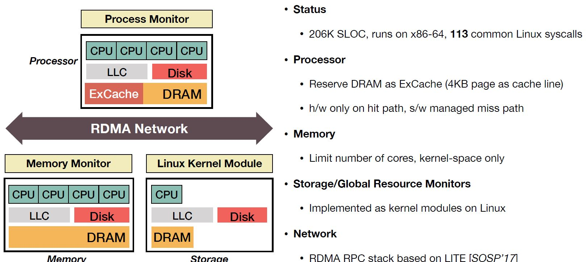

## Reference

> Yizhou Shan, Yutong Huang, Yilun Chen, Yiying Zhang. [LegoOS: A Disseminated, Distributed OS for Hardware Resource Disaggregation](https://www.usenix.org/system/files/osdi18-shan.pdf). In Proc. of USENIX OSDI, 2018. (**Awarded Best Paper**)

## What

Proposes a distributed operating system LegoOS, which is used to improve data center resource utilization, resilience, energy consumption, fault tolerance, etc.

<!-- more -->

## Why

* Modern Monolithic Server: Equipped with  with CPU, memory, and hard disk in each machine.
* Disadvantages of Monolithic Server:
    1. The resource utilization rate is not high, because CPU and Memory must be on the same physical machine. Google and Alibaba's data center resource utilization rate is only about half.
    2. The hardware is not flexible enough, it is not easy to add or subtract hardware.
    3. As long as one of the hardware on the machine is damaged, the entire machine cannot be used.
    4. Poor support for the diversity of hardware. In order to introduce new hardware, this physical machine is usually replaced, because the new hardware is usually strongly bound to the motherboard of the physical machine.
* **Main Problem: How to improve resource utilization, elasticity, heterogeneity, and fault tolerance?**

## How

* New hardwares makes breaking monolithic servers into network-attached, independent hardware components works (**Resource Disaggregation**).
    * Network: Infiniband (200Gbps,600ns); Optical Fabric (400Gbps,100ns)
    * Smart Devices: SmartNIC, SmartSSD, PIM
    * Network interface closer to device: Omni-Path, Innova-2
* SplitKernel Architecture:
    * Split OS functions into monitors
    * Run each monitor at hardware device
    * Network messaging across non-coherent components
    * Distributed resource management and failure handling
* Appear to Users: a set of virtual nodes (vNodes), similar semantics to virtual machines.
* Three types node: compute, memory, storage. 

## Some Details

* Indirection layer to translate linux ABI to legoOS interface.
* Compute node containes CPU cache and ExCache (small RAM cache) to reduce network memory latency in many case.
* System structure:

## Summary

### Strength

* With the help of modern hardware, the idea of Medusa 40 years ago was truly realized, and the problems in the system were further solved, and the work is groundbreaking。

> Ousterhout J K, Scelza D A, Sindhu P S. **Medusa: an experiment in distributed operating system structure**[J]. Communications of the ACM, 1980, 23(2): 92-105.

### Weekness

* Various resources are essentially provided by different bare metal machines, the monitor is implemented on the basis of the Linux kernel, and there are still many performance problems in practice.