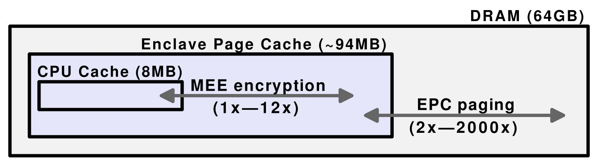
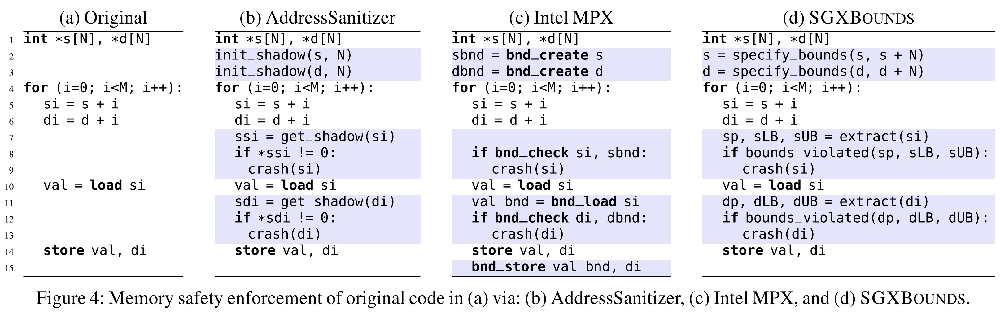

## Reference

> Dmitrii Kuvaiskii, Oleksii Oleksenko, Sergei Arnautov, Bohdan Trach, and Pramod Bhatotia, Pascal Felber, and Christof Fetzer. [SGXBOUNDS: Memory safety for shielded execution](https://dl.acm.org/doi/pdf/10.1145/3064176.3064192). In Proc. of EuroSys, 2017.

## What

SGXBOUNDS is an efficient memory-safety approach for shielded execution exploiting the architectural features of Intel SGX (Like AddressSanitizer, Intel MPX), which is based on the combination of tagged pointers and compact memory layout. And implement it as an extension of LLVM compiler.

<!-- more -->

## Why

* Shielded execution does not protect the program against memory safety attacks (violate memory safety by exploiting the existing program bugs to invoke out-of-bounds memory accesses).
* Current memory safety checker like AddressSanitizer and Intel MPX introduce high performance overhead when running inside enclave(Intel MPX will crash due to insufficient memory when working set size increase).

## How

### Design Goals

* Shielded application memory must be kept minimal due to the very limited EPC size in current SGX implementations.
* Applications spend a considerable amount of time iterating through the elements of an array, so a smartly chosen layout of metadata can significantly reduce the overhead of bounds checking.
* Rely on the SCONE infrastructure with the monolithic build process: all application code is statically linked without external dependencies, which removes the requirements for compatibility and modularity.

### Observation

* All modern SGX CPUs operate in a 64-bit mode, all pointers are 64 bits in size.
    * Only 36 bits of virtual address space are currently addressable.
    * 36 bit is not likely to be used due to performance penalties (EPC memory limit). 

### Method

* **Tagged pointers**: 
    * A 64-bit pointer contains the pointer itself in its lower 32 bits and the referent object’s upper bound in the upper 32 bits.
    * All addressable memory is confined to 32 bits and all original pointers can be replaced by their tagged counterparts.
* **Compact memory layout**
    * Tagged pointers upper 32 bits not only store the upper bound, but also store a pointer to the object’s other metadata (lower bound or LB)
    * The lower bound metadata (4 Byte) is stored right after the referent object.
    * Minimizes the amount of memory for metadata.
    * Requires no additional memory accesses while iterating over arrays with a positive increment
    * It alleviates problems of fat pointers concerning multithreading and memory layout changes
* Scenarious
    * Memory redirect when application access error.
    * Use hooks as metadata management API.

## Some Details

* AddressSanitizer uses shadow memory (a separate memory region that stores metadata about main memory of an application).
    * Allocating `redzones` around all main memory objects and marking them inaccessible in the shadow memory
    * If an application tries to read or write out of object limits,  it can be detected by checking the corresponding shadow address.
* Intel MPX keeps bounds metadata of all pointers and checks against these bounds on each memory access
    * Use 128bit hardware registers to keeping the upper/lower bounds.
    * Registers number are limited. If an application contains many distinct pointers, it will cause frequent loads and stores of bounds in memory.
* Performance overhead in different memory region:

* The added code for memory check compare between SGXBOUNDS/AddressSanitizer/Intel MPX:

* RIPE security benchmark:
    > J. Wilander, N. Nikiforakis, Y. Younan, M. Kamkar, and W. Joosen. RIPE: Runtime intrusion prevention evaluator. In Proceedings ofthe 27th Annual Computer Security Applications Conference (ACSAC), 2011.

## Summary

### Strength

* Cornerstone work in SGX memory inspection.
* Simple and clear design, achieve better results than Intel MPX hardware method.

### Weekness

* Solved the problems of performance overhead and detection failure, but limited the memory check scope to the EPC memory size (~94MB).
* Scalability cannot be compromised in many cases.