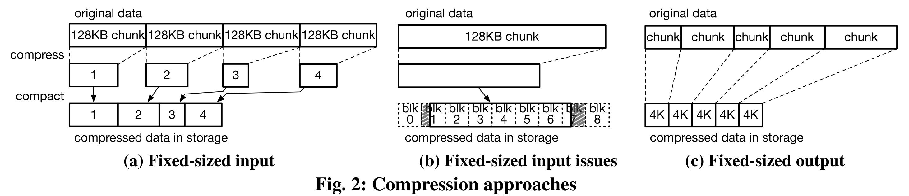
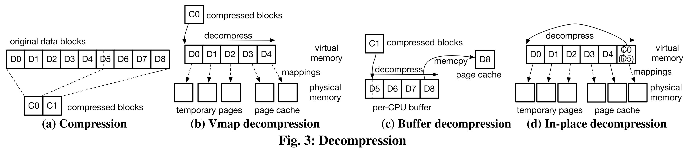
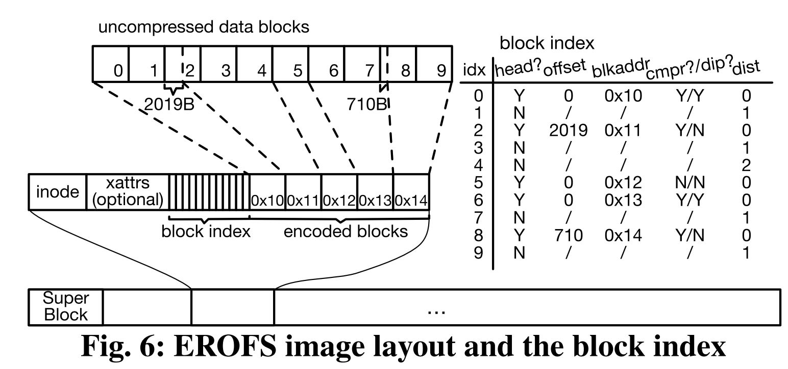

## Reference

> Gao Xiang, Dong Mingkai, Miao Xie, Du Wei, Yu Chao, Chen Haibo. [EROFS: A Compression-friendly Readonly File System for Resource-scarce Devices](https://www.usenix.org/system/files/atc19-gao.pdf). In Proc. of USENIX ATC, 2019.

## What

EROFS, a new compression-friendly read-only file system that leverages fixed-sized output compression and memory-efficient decompression to achieve high performance with little extra memory overhead.

<!-- more -->

## Why

* Smartphones have limited storage and runtime memory.
* System resources consume significant storage in Android.
* System partitions are read-only
* **Compressed read-only files** can decrease the storage used by read-only system resources.

## Main Problems

* Existing compressed read-only file systems (Squashfs) use *fixedsized input compression*:
    * Causes significant I/O amplification and unnecessary computation.
    * Used in Android lead to system higher latency / froze seconds and then reboot.
* Why Squashfs not work?
    * Use fixed-size input compression. It divide files into fixed-sized chunks for compression
    * Lead to read amplification: compression result always cross pages(I/O amplification); decompression process for useless data (in related pages) causes huge CPU wastes
    * Massive memory consumption: because compression result cross pages, more memory page need to be allocated
  

## Main Idea

Switch fixed-size input compression to fixed-size output compression.

## How

### Fixed-sized output compression

1. Prepare a large amount of data.
2. Compress to a fixed-sized blocks.
3. Repeat.

### Cached I/O (Cache for partially compressed blocks)

* Allocate a page in dedicated page cache for I/O.
* Following decompression can reuse the cached page.

### In-place I/O (Cache for requested file | blocks to be fully decompressed)

* Reuse the page allocated by VFS if possible.
* Memory allocation and consumption are reduced.

### Memory-efficient decompression

Four steps in design decompression method:

#### Vmap decompression

Decompress steps:

1. Find the largest needed block number that is stored in the compressed block (C0), which is the fifth block (D4) in the example.
2. For each decompress target of data blocks, find memory space to store them. Allocates three temporary physical pages and two physical pages that have been allocated by VFS in the page cache.
3. Due to decompression algorithm requires continuous memory as the destination of decompression, maps physical pages prepared in the previous step into a continuous virtual memory area via the vmap interface.
4. If in-place I/O, in which case the compressed block (C0) is stored in the page cache page, EROFS needs to copy the compressed data (C0) to a temporary per-CPU page so that the decompressed data won’t overwrite the compressed data during the decompression.
5. After decompression, data in the compressed block is extracted to the continuous memory area. Then the requested data are written to the corresponding page cache pages.

* Advantage
  * For all cases size
* Disadvantages
  * Frequent vmap/vunmap
  * Unbounded physical page allocations
  * Data copy for in-place I/O

#### Buffer decompression

* Problems with Vmap:
  * Not efficient for all decompression cases.

**Used when decompressed data is less than four pages.**

* Pre-allocate four-page per-CPU buffers
* Advantage
  * No vmap/vunmap
  * No physical page allocation
  * No data copy for in-place I/O
* Disadvantages
  * Only work for decompression < 4 pages

#### Rolling decompression

* Problems with decompression:
  * Requires dynamically allocate physical memory pages.
  
* **Allocates a large virtual memory area2 and 16 physical pages for each CPU.**
    * EROFS uses LZ4 compression algorithm, which needs to look backward at no more than 64KB of the decompressed data.
    * Could reuse physical memory pages (resuse the front end pages)

* Advantage
    * For decompression < a pre-allocated VM area size
    * No vmap/vunmap
    * No physical page allocation
* Disadvantages
  * Data copy for in-place I/O

#### In-place decompression

* Observation found that the vast majority of data blocks do not need to be able to be decompressed in place, and no additional space is required.
* No data copy for in-place I/O

### Image layout and block index

## Summary

### Strength

* Comparable performance with Ext4, while significantly saving storage space for system read only files.
* Work well in tens of millions of smart devices, the effect is obvious.
* Persuasive case study (camera startup speed)

### Weekness

* Evaluation that include CPU usage in the experimental design may be better.
