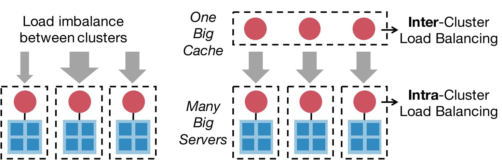
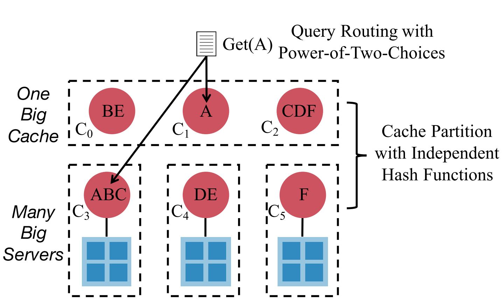
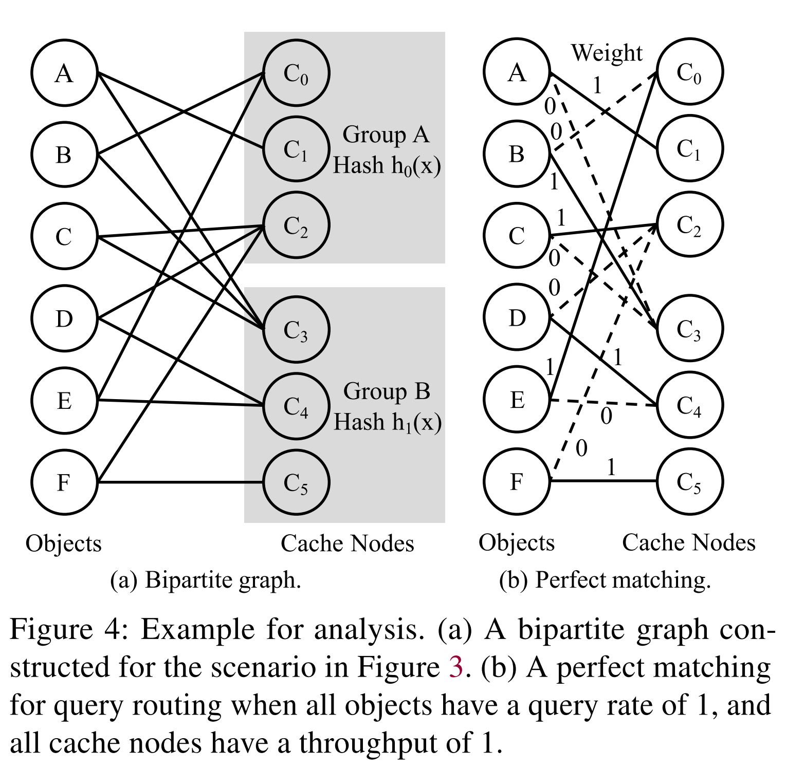

## Reference

> Liu Zaoxing, Bai Zhihao, Liu Zhenming, Li Xiaozhou, Kim Changhoon, Braverman Vladimir, Jin Xin, Stoica Ion. [Distcache: Provable load balancing for large-scale storage systems with distributed caching](https://www.usenix.org/system/files/fast19-liu.pdf). In Proc. of USENIX FAST, 2019.

## What

DistCache, a new distributed caching mechanism that provides provable (query) load balancing for large-scale storage systems.
<!-- more -->

## Why

* Load balancing is critical for distribute storage.
* A fast cache can guarantee load balancing for a clustered storage system. But not fit for multiple clusters (fast cache itself will become the bottleneck).
* Exist method like cache partition and cache replication either result in load imbalance between cache nodes or have high overhead for cache coherence.

## Design Goals

* As good as “one big cache” to absorb O(m log m) hottest items.
    * Support *ANY* query workload to hottest O(m log m) items.
    * Each cache node is *NOT* overloaded.
    * Keep cache coherence with *MINIMAL* cost.

> "One Big Cache": build only one cache for multiple clusters to cache hottest O(m log m) items, where m is the cluster number.

## How

### Main Challenges

* A cache node only guarantees load balancing for its own cluster, but the load between clusters is imbalanced.
* Use one cache node in each cluster for intra-cluster load balancing, and another layer of cache nodes for inter-cluster load balancing. **The challenge is on cache allocation.**
* Current solutions:
    * **Cache Replication**: high cache coherence cost.
    * **Cache Partition** : lead to imblance in different nodes.

### Main Idea

* Partition the hot objects with independent hash functions between cache nodes in different layers
* Adaptively route queries with different layers.

### How to allocate

**Two independent hashes $H_1$ and $H_2$ to allocate hot items**

* Cache allocation with independent hash functions.
* Upper layer and Lower layer use different hash funcations, same item will allocate to different cache nodes in different layers.

### How to query

* **Power-of-two-choices (PoT)**: route the queries guarantee stable throughput.
* PoT query can find a cache nodes perfect match for any query workload distribution.
* The sender of a query check the loads of the cache nodes that cache the queried object, and sends the query to the less-loaded node.
* Use perfect matching rather than setup a controller node for queries.
* *Proofs leverage tools* from expander graph, network flow, and querying theory

### Use Case

* Distributed in-memory caching.
* Switch-based distributed caching:
  * client side switch decides which cache node to use (PoT);
  * All switchs are programmable switches;  
  * New designed network packet format (add cache information in packet headers)

## Summary

### Strength

* Introduce graph theory algorithm to solve the best matching problem in cache node choose.
* Axiomatic proof of validity.

### Weekness

* The use case requires programmable switches to complete, the cost is very high.
* According to the paper scheme, although the service provider is avoided to provide the *control node*, the customer still needs to use the *control switch* to determine the query direction.
  