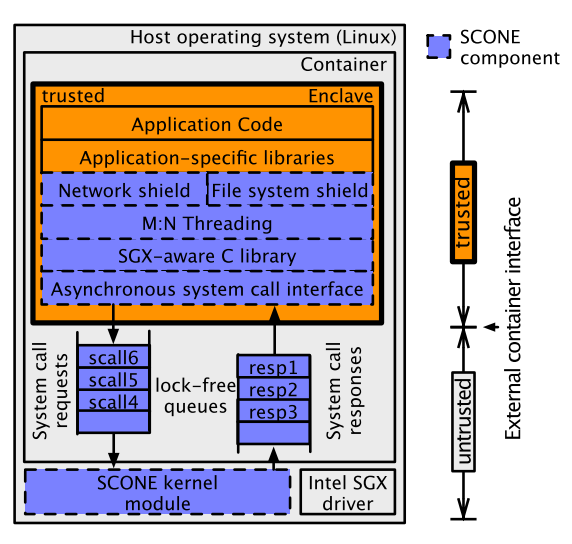

## Reference

> Sergei Arnautov, Bohdan Trach, Franz Gregor, Thomas Knauth, Andre Martin, Christian Priebe, Joshua Lind, Divya Muthukumaran, Dan O'Keeffe, Mark L Stillwell, David Goltzsche, Dave Eyers, Rüdiger Kapitza, Peter Pietzuch, Christof Fetzer. [SCONE: Secure Linux Containers with Intel SGX](https://www.usenix.org/system/files/conference/osdi16/osdi16-arnautov.pdf). In Proc. of OSDI, 2016.

## What

SCONE is a secure container mechanism for Docker that uses the SGX to protect container processes from outside attacks. It supports run unmodified Linux applications in the container within an untrusted cloud.
<!-- more -->

## Paper Summary

For multi-tenant cloud environments, Linux containers (Docker or Kubernetes) have advantages such as lower resource footprint, faster startup times, and higher I/O performance over traditional virtual machines (VMs). But the container has weaker isolation guarantees and easier for attackers to compromise the confidentiality and integrity of application data within containers.

This paper designs SCONE to secure Docker with SGX to protect container processes from outside attacks. The main challenges to designing this system are: The native system call provided by SGX is insufficient, and the size of TCB needs to be strictly controlled; Thread synchronization and system calls within SGX enclaves introduce up to 8 times performance overhead compared with Linux native system call; SGX SDK lack of filesystem and network shield interface. The main ideas are: provide enhanced C library with small TCB; Asynchronous system calls and user-space threading reduce the number of enclave exits; Provide network and file system shields to actively protect user data.

SCONE supports a set of shields for file system and network-based on transparent encryption of files, transparent encryption of communication channels via TLS, and transparent encryption of console streams. It supports an M: N threading model in which M application threads inside the enclave are mapped to N OS threads to reduce enclave transitions (Multiple OS threads can enter an enclave. Each thread executes the scheduler, which checks if an application thread needs to be woken due to an expired timeout or the arrival of a system call response or an application thread is waiting to be scheduled. At this time the scheduler executes the associated thread).
It also provides an asynchronous system call interface that consists of two lock-free, multi-producer, multi-consumer queues (request/response).

This work evaluates SCONE performance based on application benchmarks for Apache, NGINX, Redis, and Memcached. They use IOZone to test the file system shield and evaluate the asynchronous system calls performance compared with Glibc. The evaluation shows SCONE achieves 0.6x–1.2x of native throughput.

## Strength

* The first to implement a secure container-based on SGX and support running unmodified applications.
* Analysis of the problems and solutions that affect the running docker in SGX.

## Weakness

* A network shield was proposed in the design, but no relevant analysis was conducted in the experiment.

## Comments

* SCONE seems to solve only part of the program running directly in the enclave (without modification), there are a large number of unmentioned system calls, and the special needs of the application need to be designed separately.
* In the experimental part, the application analysis is quite perfect, but the two shields proposed only tested one of them (network shield is not evaluated).